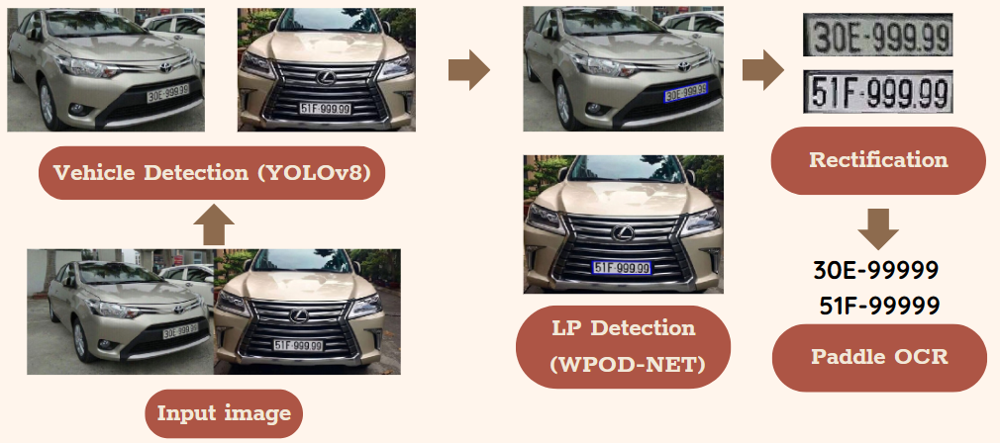
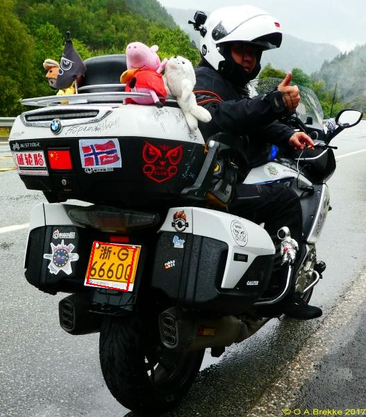
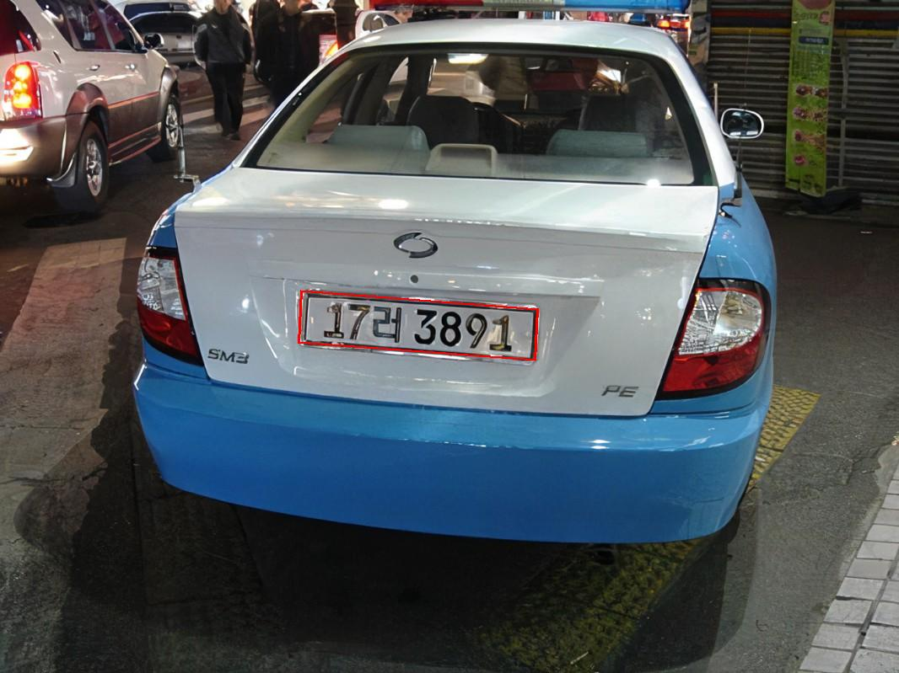
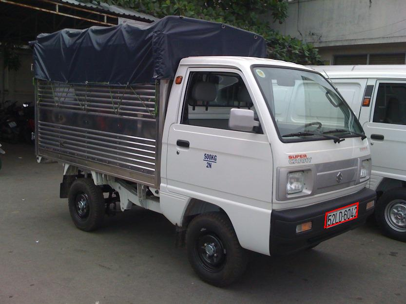
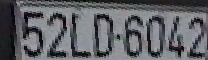
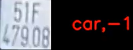

# Automatic-License-Plate-Recognition-ALPR

 

## Introduction
Our objective is the development of an Automatic License Plate Recognition (ALPR) system designed to identify various vehicles and their corresponding license plates. The system is intended to process input in the form of videos or images containing vehicles. The desired output entails the detection of vehicles and license plates, with the results prominently displayed on the respective video. 

You will gain an overarching perspective through the following pipeline:

<table align="center">
    <tr>
        <td align="center"> </td>
    </tr> 
    <tr>
        <td align="center"> Pipeline </td>
    </tr>
  </table>
  
## Table of contents:

1. [Approach](https://github.com/khoi03/Automatic-License-Plate-Recognition-ALPR#1-approach)

2. [Overview results](https://github.com/khoi03/Automatic-License-Plate-Recognition-ALPR#2overviewresults)
     

## 1. Approach
In this task, I incorporate the use of the YOLOv8 model, Warped Planar Object Detection Network, WPOD-NET for short(you can find their paper [here](https://openaccess.thecvf.com/content_ECCV_2018/papers/Sergio_Silva_License_Plate_Detection_ECCV_2018_paper.pdf) and the implementaion in Torch [here](https://github.com/Pandede/WPODNet-Pytorch)) and PaddleOCR model.
- Firstly, we commence by detecting all vehicles in the frame/image
- Next step is to identify the license plate of each vehicle. WPOD-NET exhibits the ability to recognize license plates from **diverse countries** and **diverse types of vehicles** with high confidence scores.
  <table align="center">
    <tr>
        <td align="center"> Example </td>
        <td align="center"> </td>
        <td align="center"> </td>
        <td align="center"> </td>
    </tr> 
    <tr>
        <td align="center"> Confidence score </td>
        <td align="center"> 0.9897 </td>
        <td align="center"> 0.9994 </td>
        <td align="center"> 0.9729 </td>
    </tr>
  </table>
  
- Eventually, we rectify the license plate from the frame/image using perspective transformation and input it into the PaddleOCR to get the final license plate number. In this phase, we add the **correct rules** just for **vietnamese license plate cases** to increase the accuracy of the final license plate number, so you might want to change the correct rules for your cases or disable them.
  <table align="center">
    <tr>
        <td align="center"> </td>
        <td align="center"> </td>
        <td align="center"> 52LD-6042 </td>
    </tr> 
    <tr>
        <td align="center"> Input Image </td>
        <td align="center"> Perspective transformation </td>
        <td align="center"> PaddleOCR </td>
    </tr>
</table>

## 2. Overview results

https://github.com/khoi03/Automatic-License-Plate-Recognition-ALPR/assets/80579165/d673a3bd-d0f7-4aa8-98c9-20060bec74b3

## Conclusion
While our system effectively detects vehicles and accurately recognizes license plates, it is noteworthy that the PaddleOCR component encounters challenges in extracting text from images, primarily influenced by variations in camera setup and environmental conditions. Consequently, it is advisable to consider the incorporation of a Deep Neural Network (DNN) model to enhance image resolution before feeding it into the PaddleOCR model. This approach aims to improve the accuracy of extracting license plate numbers.

Furthermore, in instances where the license plate image is visually clear and legible, the PaddleOCR may still encounter difficulties in extracting the license plate number. This phenomenon is illustrated in the following example:

